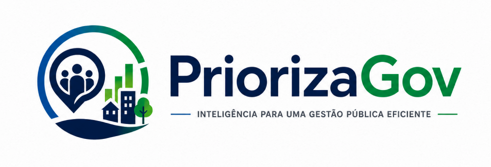

  

  Projeto Acadêmico de UX, Prototipação e Inteligência Artificial

## 📖 Sobre o Projeto

O PriorizaGov é uma plataforma digital que utiliza Inteligência Artificial para apoiar cidadãos e gestores públicos na gestão de demandas urbanas.

A solução busca tornar o processo de registro, classificação e acompanhamento de solicitações mais eficiente, transparente e acessível.

## 🚨 Problema

Muitas prefeituras enfrentam dificuldades para organizar e priorizar demandas recebidas da população.

Isso gera:

- Demora nos atendimentos
- Falta de transparência
- Baixa participação cidadã
- Dificuldade na tomada de decisões

## 💡 Solução

O PriorizaGov utiliza a inteligência artificial PriorIA para:

- Classificar demandas automaticamente
- Identificar prioridades
- Organizar solicitações
- Gerar indicadores estratégicos
- Apoiar gestores públicos

## 🎨 Protótipo Navegável

Explore o protótipo interativo do PriorizaGov desenvolvido no Figma:

🔗 **Protótipo Navegável**
https://www.figma.com/proto/u70vkswI82occMSrl7eafX/Prot%C3%B3tipo-AI---Prioriza-Gov?node-id=21-125&starting-point-node-id=21%3A125

🔗 **Projeto Completo no Figma**
https://www.figma.com/design/u70vkswI82occMSrl7eafX/Prot%C3%B3tipo-AI---Prioriza-Gov?node-id=5-1330&p=f&t=tPIeXsFn7YamfRYo-0

---

### 📱 Funcionalidades Prototipadas

#### 👤 Área do Cidadão
- Página inicial
- Cadastro de solicitações
- Acompanhamento de demandas
- Notificações
- Painel de transparência
- Configurações de perfil

#### 🏛️ Área do Gestor
- Dashboard gerencial
- Visualização de demandas
- Relatórios gerados por IA
- Mapa de demandas por região
- Gestão de usuários
- Configurações do sistema

#### 🤖 PriorIA
- Classificação inteligente de demandas
- Sugestão de prioridade
- Apoio à tomada de decisão
- Geração de insights para gestão pública

### Limitações

- Não substitui a decisão humana
- Atua apenas como apoio à gestão

### 🎨 Protótipo

O projeto foi desenvolvido utilizando:

- Figma
- UX Design
- UI Design
- Arquitetura da Informação
- Testes de Usabilidade

## 👨‍💻 Equipe

| Integrante | Responsabilidade |
|------------|------------------|
| Livya | PriorIA e Jornada do Cidadão |
| Fernanda | Problema e Apresentação da Solução |
| Vinicius | Jornada do Gestor e Validação |

---

  <strong>🏛️ PriorizaGov</strong>

  Inteligência para uma Gestão Pública Eficiente

  Projeto Acadêmico • 2026

  Livya • Fernanda • Vinicius

